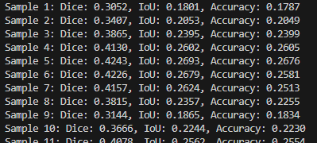
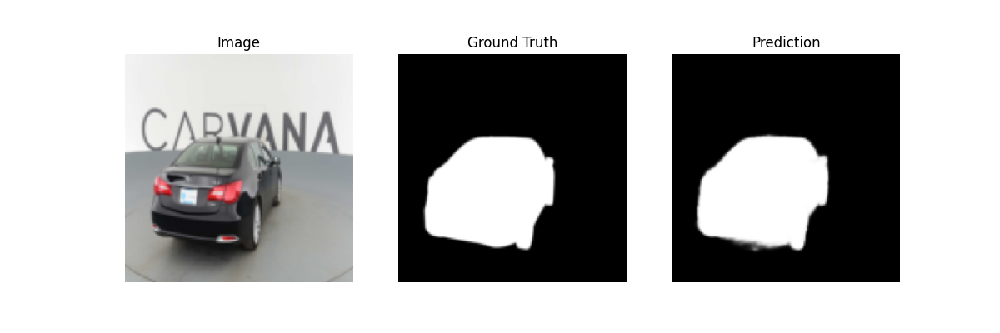

# ImageSeg_U-net

This project implements a U-Net model for image segmentation using the Carvana image dataset (car segmentation). It uses PyTorch with CUDA acceleration (if available).

---

## 🚀 Features

- U-Net architecture with skip connections for accurate segmentation.
- Supports GPU acceleration (CUDA) for faster training.
- Dice coefficient, Intersection over Union (IoU), and pixel accuracy metrics.
- Visualizations to inspect qualitative segmentation performance.

---

## 🛠️ Setup

1️⃣ Create a virtual environment (Python 3.10 recommended):

```bash
python -m venv venv
```

2️⃣ Activate it:

- **PowerShell**:
  ```bash
  .\venv\Scripts\activate
  ```
- **CMD**:
  ```bash
  venv\Scripts\activate.bat
  ```

3️⃣ Install dependencies:

```bash
pip install -r requirements.txt
```

4️⃣ Install CUDA-enabled PyTorch:

```bash
pip uninstall torch torchvision -y
pip install torch==2.2.2 torchvision==0.17.2 --index-url https://download.pytorch.org/whl/cu121
```

5️⃣ Verify GPU support:

```bash
python -c "import torch; print(torch.cuda.is_available()); print(torch.cuda.get_device_name(0))"
```

---

## 📥 Dataset Preparation

Download the Carvana Image Masking dataset:  
👉 [Carvana Dataset on Kaggle](https://www.kaggle.com/c/carvana-image-masking-challenge/data)

Organize into:

```
dataset/
├── images/
│   ├── 0cdf5b5d0ce1_01.jpg
│   ├── ...
└── masks/
    ├── 0cdf5b5d0ce1_01_mask.gif
    ├── ...
```

---

## ⚡ Training

```bash
python train.py
```

---

## 📈 Evaluation & Visualization

```bash
python test.py
```

Sample output:

| Sample | Dice  | IoU   | Accuracy |
|--------|-------|-------|----------|
| 1      | 0.305 | 0.180 | 0.178    |
| 2      | 0.340 | 0.205 | 0.204    |
| ...    | ...   | ...   | ...      |

**Visual Examples:**




---

## ⚙️ Advanced Usage

- **Adjust batch size / resolution**:  
  In `train.py` and `test.py`:
  ```python
  batch_size = 8  # increase for more GPU usage
  transforms.Resize((256, 256))  # higher resolution
  ```

- **Adjust DataLoader parallelism**:  
  ```python
  loader = DataLoader(dataset, batch_size=4, shuffle=True, num_workers=4, pin_memory=True)
  ```

- **More metrics**:  
  Edit `utils/metrics.py` to add additional evaluation metrics.

---

## 📚 References

- U-Net Paper: [Ronneberger et al., 2015](https://arxiv.org/abs/1505.04597)
- Carvana Dataset Challenge: [Kaggle Link](https://www.kaggle.com/c/carvana-image-masking-challenge)

---

## 📜 License

This project is licensed under the **MIT License**.